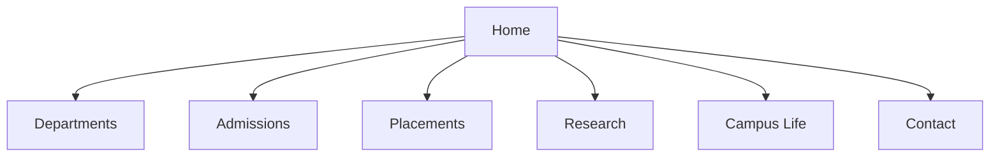

# 🚀 KPP Institute of Technology (KPPIT)

<p align="center">
  
</p>

<p align="center">
  <a href="https://pawankumar16122114.github.io/Institute-of-tech/#/contact">
    
  </a>
  
  
  
</p>

---

## 🌐 Live Experience

👉 https://pawankumar16122114.github.io/Institute-of-tech/#/contact  

  ➜  Local:   http://localhost:5173/KPP/<br>
  ➜  Network: http://10.148.98.166:5173/KPP/

---

## Quick start

```bash
cd d:\BMS
npm install
npm run dev
```

Open the **Local** URL Vite prints (usually `http://localhost:5173/`). If that port is busy, use the next port shown.

```bash
npm run build    # production bundle → dist/
npm run preview  # serve dist locally
```

### Cursor / VS Code: debugger stealing Node

If `npm run dev` exits when the debugger detaches, the repo includes [`.vscode/settings.json`](.vscode/settings.json) disabling JavaScript auto-attach for this workspace. Use a normal terminal, not “JavaScript Debug Terminal”, if issues persist.

## Tech stack

- **Vite 8** + **React 19** + **TypeScript**
- **React Router 7**
- **Tailwind CSS v4** via `@tailwindcss/vite`
- **Fonts:** Source Serif 4 + DM Sans (Google Fonts, linked in `index.html`)

## Features (high level)

| Area | Highlights |
|------|------------|
| **Navigation** | Primary nav includes: Home, About, Departments, Academics, Admissions, Placements, Research, **Progress**, Events, Library, Campus Life, Students, Alumni, Contact. |
| **Global Theme** | Header theme icon (after Contact) toggles **Light / Dark** mode app-wide and persists in localStorage (`kpp-theme-mode`). |
| **Home** | Full-bleed graduation hero, colorful stats/accreditation badges, three image-backed journey cards, moving placement marquee, events feature cards, rotating quotes, research CTA band, announcements, and floating **AI Chat** popup. |
| **Departments** | Hero, **featured department** banner, **search + discipline quick-filters**, image-backed cards with faculty/lab/programme counts. |
| **Department detail** | Image hero with **at-a-glance metrics**, full rubric sections + sticky anchor nav, clickable faculty cards with images/details, and detailed lab cards with images + focus points. |
| **Academics** | Hero, UG/PG/CE cards, **tabbed academic pillars**, digital learning / NEP dark band, academic events section, and clickable **branch syllabus explorer** with department images and colorful detail panel. |
| **Admissions** | Four-step pathway, three demo eligibility examples + Try in form, downloadable brochures/key dates (`public/brochures/*.txt`), **fees structure section**, FAQ accordion, bright CTA strip. |
| **Placements** | Placement highlights cards (student image + company + CTC), moving recruiter strip, colorful skill badges, salary-band visualization, higher-studies links. |
| **Research** | Metrics row, **cluster explorer** (switch themes), facilities + ethics band, partner tags, portal CTA. |
| **About** | Hero image, value pillars, horizontal milestone strip, leadership cards, CTA strip. |
| **Events** | Dedicated events page with colorful cards for sports, cultural, technical, and social-impact events plus quick stats. |
| **Library** | Dedicated library page with clickable requirement cards, detail panel, department-wise book availability, and institute library priorities. |
| **Campus Life** | Photo “bento” grid, tabbed life lenses (Live / Fuel / Move / Express), hostel + canteen highlights with images, upgraded colorful day timeline cards, support CTA. |
| **Students** | Quick links, handbook-style resource cards, clickable **student project cards** with images and detailed project panel, localStorage-backed checklist, FAQ accordion. |
| **Alumni** | Auto-rotating spotlight carousel with manual controls + progress indicators, impact metrics over a photo band, chapter cards, giving CTA. |
| **Progress** | Year-wise growth analytics page with animated bar graphs (admissions/staff/buildings), interactive pie-chart admission mix by year, top-performing schools, and growth intelligence cards. |
| **Contact** | Desk cards, OpenStreetMap embed, department shortcuts, enhanced form (optional phone, message counter), social strip, and Firestore-ready submit integration. |
| **AI Assistant** | Rule-based in-app Q&A available through Home floating chat for quick user questions about admissions, departments, placements, syllabus, library, and support. |

## Media & credits

- Hero and section imagery use **remote Unsplash URLs** declared in [`src/lib/images.ts`](src/lib/images.ts) (brighter, higher-energy picks). Replace with **your own campus photography** when available.
- Demo downloads live in [`public/brochures/`](public/brochures/) (UTF-8 `.txt` placeholders). Swap for real PDFs and update links in [`src/pages/Admissions.tsx`](src/pages/Admissions.tsx) if filenames change.
- Map iframe: **OpenStreetMap** embed — update bbox/marker for your real coordinates ([openstreetmap.org](https://www.openstreetmap.org/)).

## Branding

- Active logo currently uses [`public/logo-kpp.png`](public/logo-kpp.png) in header/footer and favicon (`index.html`).
- Older placeholder [`public/logo.svg`](public/logo.svg) can be kept as fallback or removed if not needed.
- Copy is **demo / illustrative**; swap for approved institute text and policies before launch.

## Backend integration (current + optional)

- Contact form currently includes Firestore REST submission wiring via [`src/lib/firebaseConfig.ts`](src/lib/firebaseConfig.ts) and [`src/pages/Contact.tsx`](src/pages/Contact.tsx).
- If Firestore rules block writes, update Firestore security rules in Firebase Console and publish.
- Optional upgrades:
  - Move contact submit to Cloud Functions for stronger validation/rate limits.
  - Add authenticated admin dashboard for viewing/responding to contact entries.
  - Add server-side spam protection and audit logging.

## 3. Additional Ideas (Mandatory)

Include the following extra features/innovations that can be implemented in future versions:

- **AI-powered admission assistant** with multilingual Q&A and document checklist guidance.
- **Student/parent dashboard login** for application status, fee receipts, and announcements.
- **Placement analytics dashboard** with company trend lines, branch-wise CTC graphs, and offer ratios.
- **Virtual campus tour module** using 360-degree images/video walkthroughs.
- **Online event registration system** with QR-based attendance and participation certificates.
- **Department comparison tool** (side-by-side programs, labs, faculty strengths, outcomes).
- **Scholarship eligibility calculator** with instant recommendation and downloadable summary.
- **Alumni mentoring connect** where students can request sessions with alumni by domain.
- **Notification center** for exam dates, result publication, and timetable updates.
- **Admin CMS panel** to update content (news, fees, events, faculty) without code changes.

## Deployment notes

- GitHub Pages uses Vite `base` path from [`vite.config.ts`](vite.config.ts); ensure it matches your repo name.
- Router uses hash routing to avoid refresh/404 issues on project pages deployment.
- Deploy command:

```bash
npm run deploy
```

## Project structure (edited often)

```
src/
  components/     PageHero, Accordion, CollageBackground, stat/placement cards
  data/           departments.ts, placementHighlights.ts
  layouts/        AppLayout.tsx
  lib/            images.ts (image URLs), highlightThemes.ts
  pages/          route-level screens
  types/          department.ts
public/
  logo-kpp.png
  logo.svg
```

## 🧠 Project Vision

> This is not just a website.  
> It’s a **digital campus ecosystem** designed for the next generation of education.

✔ Portfolio-driven learning  
✔ Industry-level UI/UX  
✔ Real-world system design  

---

## ⚡ Feature Architecture


## ⚡ Features

- 🏠 **Home**
  - Hero section with animated typography  
  - Placement highlights  
  - AI Assistant popup  

- 🏫 **Departments**
  - Search + filters  
  - Faculty / Labs / Programs  
  - Detailed pages  

- 🎓 **Admissions**
  - Step-by-step process  
  - Eligibility examples  
  - Brochures  

- 💼 **Placements**
  - Company highlights  
  - Salary insights  
  - Recruiter animations  

- 🔬 **Research**
  - 120+ publications  
  - 18 projects  
  - ₹14Cr funding  

- 🎉 **Campus Life**
  - Bento grid UI  
  - Interactive tabs  
  - Events & activities  

- 📞 **Contact**
  - Desk cards  
  - Map integration  
  - Smart form  

- 🎨 **UI Highlights**
  - Color-coded cards  
  - Bento grid layout  
  - Analytics dashboards  
  - Dark/Light mode  
  - Fully responsive
 
  - 🛠️ Tech Stack
 ``` 
  Frontend:
  React 19 + TypeScript
  Vite 8

Styling:
  Tailwind CSS v4

Routing:
  React Router 7

Backend (optional):
  Firebase Firestore
```
-🚀 Run Locally
```
git clone https://github.com/Pawankumar16122114/Institute-of-tech.git
cd Institute-of-tech
npm install
npm run dev
```

-📦 Deployment
```
npm run build
npm run deploy
```

-🌟 Future Scope
 -AI Admission Assistant
 -Virtual Campus Tour
 -Placement Analytics
 -Student Dashboard
 -Event Registration


-👨‍💻 Author
-Pavan Kumar Bukka 

 -🔗 https://github.com/Pawankumar16122114 

 -🔗 https://www.linkedin.com/in/pawankumar-bukka-333


-⭐ Final Thought
 -“Beyond papers, we build futures.” 

 
- 🚀“This project transforms a college website into a digital experience platform — where design meets functionality.”<br>
